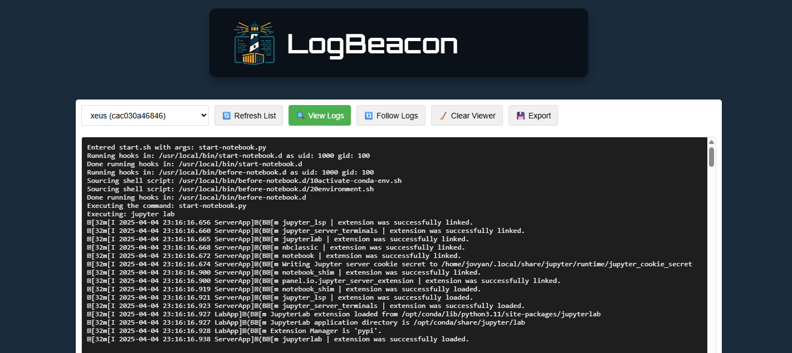

# LogBeacon

A lightweight web-based logging server for monitoring logs from all your running **Podman** or **Docker** containers — with a minimal footprint and a clean UI.



## 🚀 Features

- Automatic discovery of running containers
- View logs of **running containers**, also follow logs in real-time
- Supports **Podman** and **Docker** Containers

## 📦 Installation & Usage

### ⚙️ Clone the Repository

```bash
git clone https://github.com/kognitionlab/logbeacon.git
cd logbeacon
```

### 🖥️ Usage
📌 Requirements:
* Python 3.8+
* podman or docker installed and available in PATH
* Optionally: netifaces for better IP detection

### ▶️ Run the app
```bash
    python main.py --backend docker --port 8080 # backend "docker" or "podman"
```

### Configure Systemd service
if you want to configure systemd service on user level then copy over `containers-logger.service` to `~/.config/systemd/user/containers-logger.service`
```bash
    systemctl --user daemon-reload
    systemctl --user enable containers-logger
    systemctl --user start containers-logger
```
